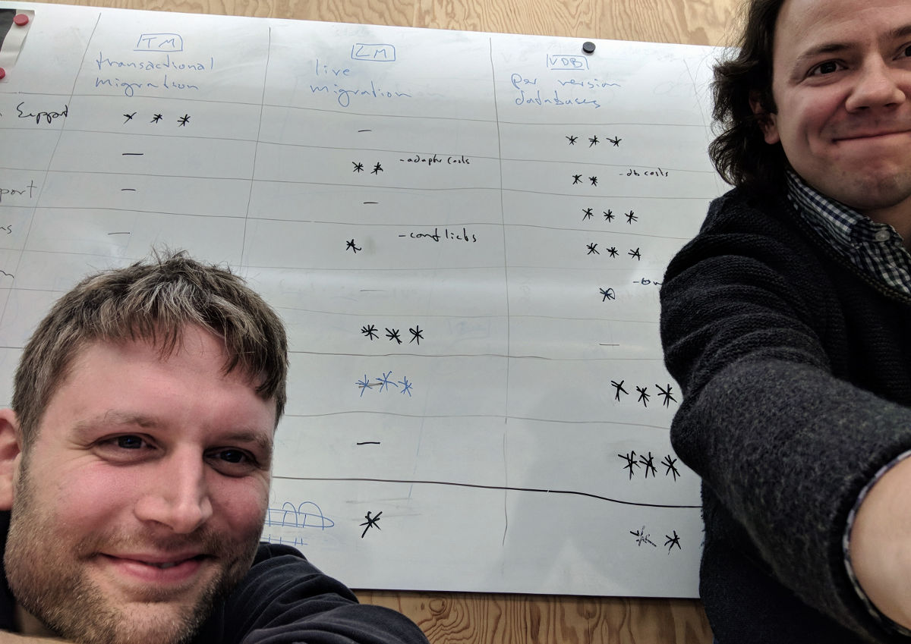

# [Sync Tank](/) Thinking about Syncing
## Thoughts. And Code. And Pictures. Maybe.
{:.no_toc}

Glad you're here! Read our first post about how to handle schema changes in CouchDB

* [Distributed Migration Strategies](/distributed-migration-strategies/)

and go deeper into praxis with

* [Chesterfield Migration](/chesterfield-migration/)

describing an eager server-side multi-version distributed migration strategy.

## About Us
{:.no_toc}

<figure>
  
  <figcaption>The authors: Matthias and Johannes</figcaption>
</figure>

Before you follow us deeper into this discussion and open your minds and hearts to what we have to say, you might want to know who we are and what we do and why you would listen to us in the first place. We are: Johannes J. Schmidt and Matthias Dumke, data architects at a company called [immmr](https://www.immmr.com/), a subsidiary of Deutsche Telekom. The company's main product, [Orbit](https://www.orbit-app.com), is an offline capable app that brings communication to the next level as they say in the product department. It's designed to operate at a large scale in a variety of network conditions (no data available, only GSM, etc.). Our agile teams work on Android, iOS, desktop and web clients as well as on server-side services. Our role is to ensure a seamless integration of data synchronisation between all parts of the system, which is why we are facing on a daily basis all the above mentioned challenges of changing data structures in an offline capable multi client environment.

Moreover Johannes has a decade's worth of experience with distributed databases. He has authored and worked on several widely used tools in the Apache CouchDB ecosystem. He is the main author of the [CouchDB Best Practices](http://ehealthafrica.github.io/couchdb-best-practices/) guidelines he compiled during his work at [eHealth Africa](https://www.ehealthafrica.org/).
