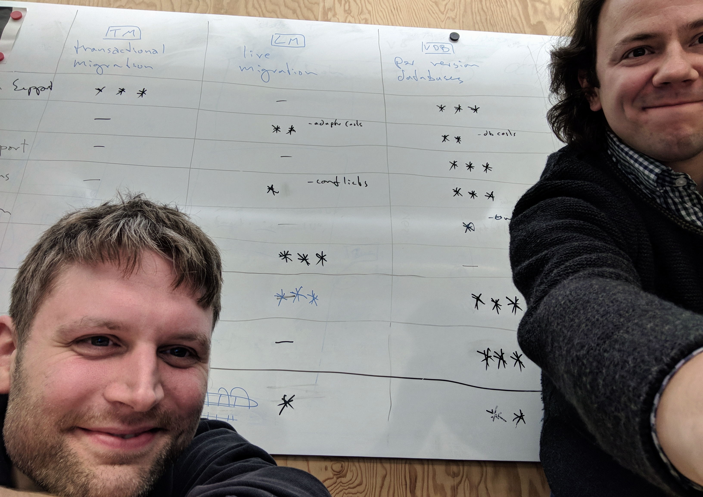
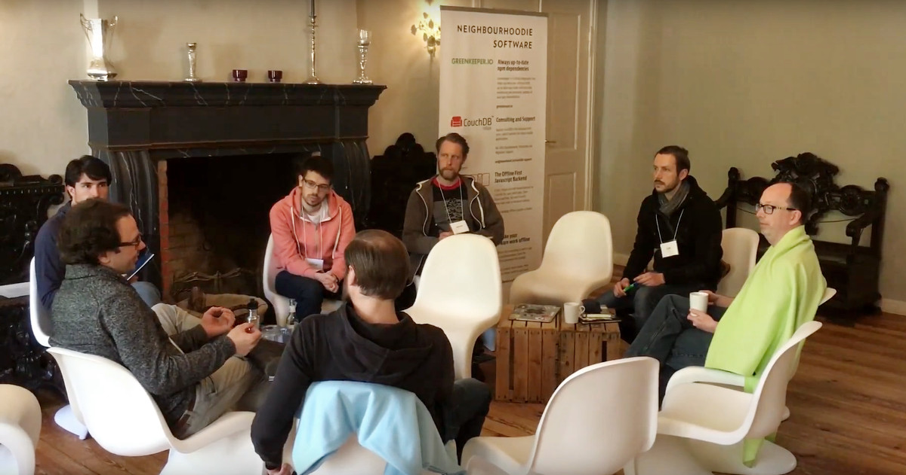
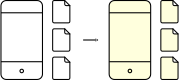
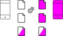

# Distributed Migration Strategies
How to handle schema changes in CouchDB

## Table of contents
{:.no_toc}

1. this unordered seed list will be replaced by toc as unordered list
{:toc}

## Introduction

> Software development is change management - Ashley Williams, [A Brief History of Modularity](https://www.youtube.com/watch?v=vypCsVm5z28) at JSConf EU 2017


Imagine you've done everything right: you've built this big, offline-first, decentralized, scalable system that supports all sorts of clients. Your agile teams are working on different parts of the software ecosystem. Of course, your application is live and well, customers are happy - and they demand new features.

So you have to change the data structure.

In a classical monolithic server-side architecture this is more or less a solved problem [cf...], not so for decentralized systems. Here we face two formidable challenges:

1. we cannot rely on transactions to transform data, and
2. there might be clients around that still depend on older versions of the schema.

How can we address the problem that there may be clients running older versions of our application? How can we deal with the fact that an older application might be confronted with newer data because other clients in the system have been updated already and are distributing newer versions of that data? These are among the questions we will have to answer if we want to build larger systems with enough flexibility to respond to change-requests.

At the time of this writing, this is still largely unexplored terrain. You will have a hard time finding articles on this topic, let alone guidelines or collections of best practices. In this article, we will make an effort to start filling this gap. In what follows, you will find a detailed exposition of our thoughts on different strategies for managing distributed data migrations in Apache CouchDB. We will start with simple solutions for simple scenarios and work our way up to the complex offline-first, decentralized, multi-client, scalable systems that we are challenged to build.

<figure>
  
  <figcaption>The authors: Matthias and Johannes</figcaption>
</figure>

Before you follow us deeper into this discussion and open your minds and hearts to what we have to say, you might want to know who we are and what we do and why you would listen to us in the first place. We are: Johannes J. Schmidt and Matthias Dumke, data architects at a company called [immmr](https://www.immmr.com/), a subsidiary of Deutsche Telekom. The company's main product, [Orbit](https://www.orbit-app.com), is an offline capable app that brings communication to the next level as they say in the product department. It's designed to operate at a large scale in a variety of network conditions (no data available, only GSM, etc.). Our agile teams work on Android, iOS, desktop and web clients as well as on server-side services. Our role is to ensure a seamless integration of data synchronisation between all parts of the system, which is why we are facing on a daily basis all the above mentioned challenges of changing data structures in an offline capable multi client environment.

Moreover Johannes has a decade's worth of experience with distributed databases. He has authored and worked on several widely used tools in the Apache CouchDB ecosystem. He is the main author of the [CouchDB Best Practices](http://ehealthafrica.github.io/couchdb-best-practices/) guidelines he compiled during his work at [eHealth Africa](https://www.ehealthafrica.org/).

## Who is CouchDB?
TBD

Move 'why couchdb' paragraph from below (chapter 4) to here

- Why CouchDB?
  - scalable document oriented store with map reduce
  - can sync (multi master replication)
  - CouchDB is a mature Open Source project under the Apache foundation
  - clients available for major platforms (Browser, Android, iOS)
- CouchDB alternatives for sync
  - See [Comparison Matrix of Offline Sync Protocols and Implementations by bradley-holt](https://storage.5apps.com/basti/public/shares/171109-2113-index.html) (temporary link, will be published to offline first website)
  - there are not really production ready x platform open source alternatives
  - and we already know a lot about CouchDB, so why not?
- CouchDB basic concepts
  - http API
  - databases are lightweight, `PUT $COUCH/my-db`
  - atoms: documents
    - `_id` is a db wide unique identifier (string). Put here everything you want to have unique.
    - `_rev` is optimistic locking mechanism. For each doc a revision tree is maintained. A linear revision history can be branched during replication. Old revisions are removed during compactation, but not so the revision tree.
    - `_conflicts` can arise during replication in a split brain scenario. CouchDB keeps all conflicting revisions and decides on a deterministic way a winning rev
  - the [replication protocol](http://docs.couchdb.org/en/2.1.1/replication/protocol.html) based on basic http api
    - there is pull and push replication, for sync use both
    - you can filter replication via Mango selectors or (traditionally) by using filter functions
  - Querying
    - Map Reduce [Simplied Data Processing on Large Clusters](https://static.googleusercontent.com/media/research.google.com/en//archive/mapreduce-osdi04.pdf)
    - [Mango selectors](http://docs.couchdb.org/en/2.1.1/api/database/find.html) are based on map reduce. Use a declarative JSON syntax to find documents.
- Background of this article: eHealth, immmr, offline-camp
  - Johannes worked on eHA together with Jan Lenard on a first migration concept
  - when he joined immmr he faced fear of changing data schema
  - sat together with Ben Kampmann and invented the Per version database migration concept
  - discussed this concept on the [offline camp berlin 2017](http://offlinefirst.org/camp/berlin/) with Gregor Martinus, Bradley Holt, Martin Stadler and others

<figure>
  
  <figcaption>Foto by Gregor Martinus: Migration session at Offline Camp 2017 Berlin</figcaption>
</figure>


## Setting the stage: A toy problem

While this article is not supposed to be a tutorial, it will be instructive to have a working example at hands to illustrate some points. Our example of choice is the 'Hello World' of apps, the todo-app. A simple todo-app does not look like the most daunting challenge to face from a data architecture perspective: todos can have titles and texts, maybe a creation date and a done-flag. None of this would make you sit down and write an article about different strategies for how to accomodate this information. But things get a lot more interesting once we agree to meet a few additional requirements:

1. Users should be able to edit their todos even when their internet connection is unstable or down and the application should synchronize all changes once it re-connects. In other words: the app must be offline-capable (what exactly this means will become clearer as we go along).
2. The application development should be agile, meaning that we want to support frequent changes to all aspects of the system, including the data schema.

These two requirements lead us to think about distributed migrations. This may start in the product department, where product managers [obviously](https://medium.com/swlh/designers-will-design-developers-will-develop-and-why-you-must-stop-them-399255275593) want to evolve the app into a full-fledged project management suite.Product decides that a todo should no longer just be open or done but should hold a number of different progress states like 'started', 'blocked', 'rejected', 'completed', etc. No problem, right? We just tweak the schema a bit, the todo state is no longer a Boolean but some form of String or Enum that can hold multiple values and we are done. - But wait, what about the todos that are already in the system? - Maybe we can update them? Or maybe the apps should be able to deal with both kinds of todos? - So we should support two schema versions now and old documents are still valid? And what if someone is using the old version of the app on their phone? The old version doesn't know anything about the new progress states. How could it possibly deal with documents of the new format? - We could force people to upgrade their apps so everybody at least agrees on the new schema. - So you want to make the entire application unusable unless someone goes to the appstore and updates to the latest version? This is not very appealing. - Do you have a better idea?

In fact, we do. Stay tuned.

At this point we have gotten a bit ahead of ourselves and are already discussing migration strategies, albeit in a somewhat hasty and unstructured manner. But at least we understand the problem now.

This is actually a good time to take a step back and clarify some concepts that will be important throughout this whole discussion. Before we talk about schema migrations in distributed systems, let's talk about what schemas and migrations and distributed systems are in the first place.


## Basic concepts: schemas, migrations, and distributed systems

If you want to store and retrieve data in an automated and efficient way, it is important to have some knowledge about the format or structure of this data. This is meta-information specifying things like data attributes and the data types to be used to store them. We would like to think of the **data schema** as all relevant structure-information about the different pieces of data to be stored by an application.

On this general account, a schema formalizes the structure of your data. Many database systems actually require in advance an explicit account of what the data to be stored is going to look like. PostgreSQL for example allows to store relational data where entries have to adhere to one of the [available data formats](https://www.postgresql.org/docs/8.4/static/datatype.html). These formats will even be validated on store-time.

But even if you opt for a schemaless document dataase you will not get away from data schemas at all. This is because in the end what defines a schema are the assumptions the applications make.

> "Usually when you're talking to a database you want to get some specific pieces of data out of it: I'd like the price, I'd like the quantity, I'd like the customer. As soon as you are doing that what you are doing is setting up an implicit schema."
>
> Martin Fowler, [Introduction to NoSQL](https://www.youtube.com/watch?v=qI_g07C_Q5I)

Thinking in terms of implicit schemas as defined by the application's expectations may require a change of perspective, but it will benefit us in the long run. Having said that, we would still like to mention that there are tools for making schemas more explicit even when working with schemaless databases. There is, for example, the very flexible [JSON Schema](http://json-schema.org/) specification, and CouchDB is going to introduce server-side validations via the Mango-Query language in the near future. This allows us to harden the data schema, enforcing requirements on the structure of the data before storing it, to the degree we see fit. We might, for example, require the titles of our Todo-items to be strings of a certain maximum length, while we want to pose stricter format-requirements on the ids of our documents, which should be, say, strings that have to match a very specific pattern. To give but one example of how this might look in a JSON-schema document, consider the following abbreviated specification.

_Using JSON-schema to formalize format-requirements of our Todo-documents..._

```json
{
  "id": "todo-item",

  "properties": {
    "_id": {
      "pattern": "^todo-item:[a-f0-9]{32}$",
      "type": "string"
    },

    "title": {
      "maxLength": 64,
      "type": "string"
    }

    "isDone": {
      "type": "boolean"
    }
  },

  "required": [
    "title"
  ]
}
```

_...and a corresponding valid document_

```json
{
  "_id": "todo-item:02cda16f19ed5fe4364f4e6ac400059b",
  "title": "Clean the dishes",
  "isDone": false
}
```

In short, introducing format-requirements on schemaless databases opens up a space between purely implicit schemas and explicit ones, providing greater flexibility when it comes to specifying and changing schema definitions.

Flexibility of the (implicit) data schema becomes important once the application starts to change. Let's revisit the example from above: our todo-app is suddenly required to deal not just with a done-state that can be true of false, but is supposed to display one of many progress-states. If we decide to completely remove the done-state and replace it with a progress-state, we will have to transform existing todos so that the new version of our application can handle them. Changing existing data to adhere to new requirements is called a **data migration**.

In the current example, we are not *forced* to migrate existing data. It would be possible to get around a migration if we kept the done-state, introduced a new progress-state, and gave our application the ability to deal with both versions of todo-documents. Of course, this strategy has its own problems, as we will discuss in greater detail below. For now, we would just like to settle on an account of what data migrations are: they are changes to the structure and format of existing data to meet new requirements.

The last concept to address are **distributed systems**. According to the Wikipedia,

> "A distributed system is a model in which components located on networked computers communicate and coordinate their actions by passing messages."
>
> Wikipedia, [Distributed computing](https://en.wikipedia.org/wiki/Distributed_computing)

To apply this broad definition to the CouchDB environment, we can interpret database documents as messages, data transfer via replication as message passing, and the various apps on phones and in browers and the backend services as the components located on networked computers.

In our example we look at a distributed todo application with offline capable clients, which implies that we will have to store data not only on a server but also on the respective user-devices, which in turn must be enabled to synchronize data updates with the rest of the system so all parts can be up to date.

In this distributed scenario, different applications can make very different use of the same data. An Android App may use the data to display a list of todos to the user while a backend service may be interested in the metadata to build usage profiles. We therefore have software that accesses, processes, and stores data in very different locations and according to their very different requirements. For the whole system to be intact it is mandatory that the structure of the data is not changed in any unforseeable way. The different parts of the system, and consequently the different teams working on the different parts of the system, are bound by an (implicit) contract, by the (implicit) data schema they all have to respect. We may even go one step further and say that *the data schema is the effective database API* of the distributed system because it ultimately defines the way in which data can be accessed. From this perspective, a schema-change implies an API change for any part of the system that is dependent on the data. This is why it is of such importance to have a strategy for dealing with schema-changes.

When migrations become necessary in distributed systems, we run into the complex issues we have already briefly encountered above. But we're not going to address all of them at once. Instead, let's shift gears and start building our todo-application again, this time from scratch and with only some simple requirements at first.

## Make your schema explicit!

- json schema paragraph from above
- semver for data schemas
- validation options


## A Server-side Todo-web-app

In the simplest of todo-app scenarios, we want to enable a number of users to manage a few, or maybe a few thousand todo items from the comfort of their web browser. The basic building blocks to set up such a service are: a client-side application to provide a nice interface, a server to deliver that application, and a central database that stores all those todos, and bit of infrastructure to glue the pieces together. We can all agree on that. Of course, we will most likely not agree on the technology stack to actually build this, including which database system to make use of. Let us sketch out our approach.

You might be tempted to go for a big relational database where you store user data and todo items and implement has-many relations between them via foreign keys. We've all done that at some point. But here we anticipate that we will need a lot of flexibility in the future and that this big, centralized RDBMS might not be malleable enough to adapt to our upcoming needs, especially when it comes to offline-capable client applications at some point. This is why we advocate a different choice at this point and begin developing our todo-app using Apache CouchDB. In case you didn't know,

> "Apache CouchDB™ lets you access your data where you need it by defining the Couch Replication Protocol that is implemented by a variety of projects and products that span every imaginable computing environment from globally distributed server-clusters, over mobile phones to web browsers."
>
> From the official Apache CouchDB Documentation

That sounds promising, doesn't it? Now the way we set up the system is according to a common practice in the CouchDB world: each user gets their own database on the server and can connect to it through a client application. This means there is no way to get access to anybody else's data and we don't even have to worry about things like associations and foreign keys for the time being. Everybody manages their own todos in their own database. And yes: once our product goes viral and there are two million users there will be two million databases. Well, Ops problem. In fact, Ops will be happy to find out that CouchDB comes with clustering abilities so scaling up is not a terrifying prospect (unlike when you run out of space with your relational database).

For now, this piecemeal approach of worrying about one user and one database at a time simplifies our problem. To complete the first step and bring version one of our todo-app to the market, all there is to do as far as the schema is concerned is to decide how a single todo item is supposed to look. And since we wanted to start simple, and since the *sine qua non* of a todo item is basically just a title and a flag, here's an example of the first, launch-ready version of a valid todo item document to be stored in a user's CouchDB:

```js
{
  "_id": "todo-item:cde95c3861f9f585d5608fcd35000a7a",
  "title": "reimplement my pet project in Rust",
  "isDone": true
}
```

## The world is changing: new requirements

The first weeks have passed, marketing has done a great job and our app is quite popular, especially with young professionals in urban areas that are also single mothers. Feature requests are coming in and a decision is made to enhance the product. So we face a new requirement:

```cucumber
As a web app user
I want to mark a todo as important
so that I can find it easier.
```

Obviously the data schema will need some enhancements in order to store that new information. In particular, we will want to add an `isImportant` flag to each todo-item. This change is rather unobtrusive because it leaves already existing todo items intact: since existing documents will not have the `isImportant` attribute, we can simply treat them as not important by default. All we have to do is make sure the app will be able to handle missing `isImportant` flags.

This change was not too hard to implement. A second request that many users have made is the ability to change the color theme of their app:

```cucumber
As a web app user
I want to choose between different color themes
so that I can express myself by personalizing my tools.
```

Obviously, this feature has no implications for the todo items. We decide to introduce a new document type, a `settings`-document, that will store the color information and perhaps other general requirements that will come up in the future. Since we only need one global settings document, we can set the `_id` to something simple.

```js
{
  "_id": "settings",
  "color": "#e20074"
}
```

As with the introduction of an `isImportant` property, the new settings document will not cause existing apps to break. Instead, we can use this document to enhance the experience for users of the new app version. If there is no settings document, the application can simply use the default color that already exists. And if an older app does not know how to deal with settings-documents, it may safely ignore it.

So far we have amended the todo-schema and introduced a new document type. Both operations are non-breaking feature changes to our data schema according to semantic versioning. But now let's look at yet another feature request that will have a deeper impact on our data format:

```cucumber
As a web app user
I want to assign one of many states (`active`, `blocked`, `done`, ...) to a todo item
so that I can have fine-grained control over its progress.
```

We already have the `isDone` property in place that keeps track of an item's progress. This will have to be replaced by another property, call it `status`, that we can use to store the different progress states. You might be tempted to simply replace one field with another, which would lead to documents like the following:

```json
{
  "_id": "todo-item:ce2f71ee7db9d6decfe459ca9d000df5",
  "title": "change the world",
  "isImportant": true,
  "status": "active"
}
```

This is a valid strategy, but let's take a moment to go the extra mile and think about an even better solution. Up to this point, a todo item was a rather coherent set of attributes. Yes, a title may change, people were able to mark todos as important and at some point in time many of the items would have been marked as done. In all those cases the document would have to be updated. However, these changes can be expected to be relatively rare. In contrast, we're now introducing the concept of a multi-valued status that may change many times across the lifetime of a todo item. It would be great if we didn't have to update the whole document every time someone changes the status. This is why we propose to split the document in two, have a todo item document and save the status separately in a new document type.

_The remaining core todo item..._

```json
{
  "_id": "todo-item:ce2f71ee7db9d6decfe459ca9d000df5",
  "title": "change the world",
  "isImportant": true
}
```

_...and the corresponding status document._

```json
  "_id": "todo-item:ce2f71ee7db9d6decfe459ca9d000df5:status",
  "status": "active"
}
```

Note how the association of status and todo item is established via the `_id`-attribute that is not just used to determine the document type. Splitting the document allows us to group attributes together that change together frequently. Here is not the place to get into a detailed discussion of this aspect of data-design, but we hope it has wet your appetite to learn more. If that's the case, check out the [couchdb-best-practices]() guidelines.

At this point, we have reacted to the last of the incoming feature requests. We can release a new version of the web app that allows users to set different progress states for their items. But what about the items that have been created in the past? The previous approach does not seem to work: we cannot simply choose some sensible defaults and assume that old documents are still valid. Instead we have to find an explicit way to map the old `isDone` values to the new `status`, in other words: we need a data migration!


## Server-side transactional migrations

We are now at a point where a new version of an application is confronted with older documents in the system that it does not know how to handle. One way of approaching this issue would be to make the app more complex to enable it to deal with older schemas. We will discuss this approach in more detail in the section on live migrations, but for the time being there is a much more common practice that is used in this scenario, one which changes not the app but the data. We will call this approach a 'transactional migration'.

<figure>
  
  <figcaption>
    <b>Figure 1: Transactional Migration.</b>
    <span>
      Introducing a new version of an application may require us to update existing documents (white) to a new version (magenta). This switch happens at a single point in time. Some documents (two-colored example) can be handled by both app versions and do not need to be transformed at all.
    </span>
  </figcaption>
</figure>

Since we have stored all our data in one central database, it will be easy enough for us to access all existing todo items and update them to adhere to the new schema. Ruby on Rails's way of handling migrations provides a very straight forward example of this approach. In Rails we would define a migration that formalizes the schema change (prepare the database to store the new `status`, move existing `isDone` information over into the `status`, `isDone` field from the todo item table). We would then take the system down, run the migration (the famous `rails db:migrate`, formerly `rake db:migrate`), and hand out the updated application once the database is back up. If anything goes wrong during this process, there will be a rollback because the migration is wrapped into a transaction. During the process we will of course incur some downtime, but on the plus side we always have consistent and up to date documents and everyone will get the latest version of our application.

TBD: How to do transaction migration in couch?
- setup new cluster (simulate transactions)
- switch to maintenance mode
- replicate
- migrate and check
- if successful: switch to new cluster
- maintenance mode off

_Figure 1_ illustrates the transactional migration strategy. It shows how both the application and the documents are updated together in a single step. White documents can be handled by the white version of the app while the magenta app needs magenta documents. A special case is the two-colored document. There might be documents that do not need to change during a migration and that can be handled by multiple versions of the client. Think of the settings document we have added previously. Even if we have to change the structure of todo items does not mean we have to change how the settings document looks.

This kind of transactional migration procedure is very common for the type of monolithic centralized setup we have described so far. It does not come without some [problems of it's own](https://about.futurelearn.com/blog/your-database-is-a-distributed-system) but overall it is a well established and reliable practice. Alas, this is not a viable solution anymore once we ask that our application continue to work without a connection to the internet.


## Going offline is harder than it looks

Up to this point our todo application will simply stop working when the internet connection is down. Instead of the app, users will get a message that they are offline. Or - even worse - if the connection is unstable they will not even get notified about that but they might simply see a white screen while some request is underway and they will wait and hope for a response and wait and hope for a response and wait and eventually get frustrated.

To fix this, we would like users to be able to access the app and perform all the relevant CRUD operations on todo items even if the internet connection is not reliable. Let's make this a feature request:

```cucumber
As an application user
I want to edit todo items even when my internet connection is unreliable
so that I can plan my life without worrying about network quality.
```

This could be done by building full-fledged desktop or native apps or, to start simple, by transforming the already existing web application into a *Progressive Web App* that can be persisted by the browser. In any case, all the relevant application data has to be stored on the client.

Now that a user can create or edit todo items even when the client is offline we need to provide a way to synchronize any changes once it comes back online. Luckily we have CouchDB in our team! There are a number of client-side adaptations like [PouchDB]('') for browsers or [Cloudant sync]() for phones that provide CouchDB-like storing capabilities for clients and implement the Couch replication protocol so synchronizing data between different parts of the system becomes simple and fun.

We're not done yet, though. We do have an application that does not break when the client is offline and that synchronizes changes. But how can we stay agile with this kind of setup? Lets put it this way:

> "Document databases are really cool… until you have to make a breaking change to the schema. Then it feels like “good luck with all that!” :D"
>
> Ben Nadel [on Twitter](https://twitter.com/BenNadel/status/918604059304779776)

To illustrate the problem, let's get back to our previous example and assume we have a working todo app where we have to upgrade todos from a simple `isDone` to a more detailed `status`. Remember, the app has been live for a while, people are using it in version one and they are working with documents that are stored according to schema version one. If we now want to release version two of the app, we might not reach all users at once because some of them are currently offline thanks to our latest enhancements. So we have to deal with the fact that there are old versions of the app around. And they are working with old versions of the documents. Let's call this the *parallel versions problem.* How can we perform a proper data migration in this scenario? Here are some not so successful attempts to get a feeling for why this problem is tricky.

#### Transactional server-side migration

Why can't we just reuse the strategy that has worked well before and update all existing documents on the server?

This means that we would pick a single point in time where we update all documents on the server to be compatible with the new application. To see why this fails, consider the following chain of events: Haneen is using the app, version one, in her browser right now. Now you migrate the documents on the server-side database and prepare to hand out the new version of the app. Meanwhile, Haneen has just updated her todo item. The change takes a moment to synchronize to the server, it may also take some hours if she is currently offline. The updated todo item arrives at the server, but because Haneen is using version one of the app, the document that arrives will be outdated. We have inconsistent data in our database.

#### Continuous server-side migration

What if we still use a transactional migration but amend it in the following way: after migrating all the documents, we could look at each incoming new document on the server and if there is an old document we could simply update it.

This approach would solve the previous problem. If an older app inserted an older document the rest of the system would not have to worry about that because it would only the updated version. To implement this we would need a possibility to listen to incoming documents so we could update them. CouchDB provides such an option through the `changes` endpoint that allows us to keep track of every event that happens in the database. A backend service could watch this endpoint and perform an update if any older document comes in. A closer look at the CouchDB API reveals that change documents basically consist of a change id and the id of the document that was subject to the change. From this it is clear that 


TBD: Implementation Details:
  - the old document is replicated to the server-side db
  - we listen to the (-> Global Changes Feed)
  - the document is migrated and the old version is deleted.

But let's think further: what if the new document gets synced to the old app? 


#### Server-side adapters

Can we update outdated documents when they arrive at the server? We could provide a versioned API, the old app sends old documents to the previous API version, and a service updates the document to the latest version before it gets persisted.

As a general migration strategy, this looks very promising indeed. It would allow us to write adapters for each API version that could migrate documents on the fly, up and down. However, we cannot pursue this path further here because CouchDB does not provide any hooks that we could use to insert our adapters into the dataflow. This would have serious consequences for many aspects of the system including the replication mechanism. Since this is not an option, let's not have this discussion right now and focus on what is feasible.

#### Client-side transactional migrations

How about performing a transactional migration on the clients? Offline clients could use the old schema as long as they are offline, but once the client is updated to a new version, the first thing it does is migrate all existing data in the client-database which then later syncs the updated data to the server.

This approach will work, but only in a restricted environment. In particular, it will only work if we have a single client. If your business case allows you to restrict users to only have one single device to use with your application, you might be fine, but once any additional clients enter the stage we are in trouble. Here's why: If you have multiple clients, *each one* will have to perform the transactional migration (otherwise we would be back to the problems we encountered with the first attempt). But if each client updates documents in parallel and syncs them accross the system, this will lead to a large number of update conflicts (read more about [update conflicts]() if you are not too familiar with how they can arise). In principal, CouchDB allows you to handle conflicts and even ignore them so they will be solved automatically, but in this scenario, the large number of conflicts can have an impact on the performance of our system.


## Client-side live migration

We will use the term 'live migration' to describe on-the-fly transformations of documents to adhere to a different data schema. We have encountered this idea briefly in the previous section when we talked about server-side adapters. Unfortunately, this approach was not feasible. Let's now talk about equipping clients with the necessary capabilities to deal with different schema versions.

The basic idea is to enable an application to read documents with older versions through adapters. Figure 2 illustrates the strategy in broad strokes: an adapter is provided to update the old (white) document type to a newer version which the new app knows how to handle.

<figure>
  
  <figcaption>
    <b>Figure 2: Live Migration.</b>
    <span>
      An adapter enables the application to read documents of older formats. When it comes to persisting them the app will store the documents in their updated version.
    </span>
  </figcaption>
</figure>

To make this point more concrete, let's take another look at our current problem with the todo app. We already have todo items in the system and we want to release a new version of the app that works with new document versions. The application can read and write these new documents, but what if it encounters an older document? In this case, we could provide it with an adapter that takes in old documents and returns new ones. Here's the case in point:

_An adapter takes in a todo item with an old schema:_

```json
{
  "_id": "todo-item:8f5e6edb6f5208abc14d9f49f4003818",
  "title": "Calculate the carbon footprint of a bitcoin transaction",
  "isDone": true
}
```

_And it returns the updated documents, a todo item and a status-document with a plausible mapping from `isDone` to `status`:_

```json
{
  "_id": "todo-item:8f5e6edb6f5208abc14d9f49f4003818",
  "title": "Calculate the carbon footprint of a bitcoin transaction"
}
```

```json
{
  "_id": "todo-item:8f5e6edb6f5208abc14d9f49f4003818:status",
  "status": "done"
}
```

From this point on the app knows how to proceed. Using the adapter, it can treat older documents just as if they were new ones. This looks like a promising strategy, and it is also very efficient because first there is no need to keep multiple versions of documents around, and second transformations will only happen when they are actually needed. This strategy also addresses the problem that an app that is currently offline may continue to create old documents because it hasn't been updated yet. These documents will be synchronized across the system but they will not cause trouble because newer apps have adapters to deal with them.

While this approach seems quite elegant in the scenario we're facing here, i.e. a small application with a very simple change, it may not be the best solution for more complex situations. Plus it has a major drawback that we'll have to address as well. So let's start talking about the downside of client-side live migrations.

#### Functionality duplication leads to unnecessary code

The first problem to address is one of complexity and maintainability. A bit of accounting can help us get the discussion started. Say we start off with a single document type that is in version `v1`. We now update the schema to `v2`, so the app will need an adapter to deal with the older `v1` documents. After the next update to `v3` the new app will now need two adapters: one to deal with `v2` documents and one to deal with `v1` documents that may also still be around. In general, every app that has ever existed in the system may have left documents in the corresponding old versions around. Since we can never be sure that there are no ancient schema versions around we will have to provide `n - 1` adapters for an app that uses data schema version `n`.
But there's more. Since clients can be offline or not get updated, older versions of clients need additional adapters to migrate documents up to their specific version and those add up to what we have to maintain. To round off this part of the analysis, let's just say that all app versions that have ever existed may still be used somewhere, and accordingly all document schema versions that have ever existed will need to be supported. If the current schema version number is `n` we would need to provide

$$
(n - 1) + (n - 2) + ... + 2 + 1 = \sum_{i = 1}^{n - 1} i = \frac{n (n - 1)}{2}
$$

adapters.

We're not done yet. So far, we have just looked at a single document type, but our schema can accomodate dozens of them. In our example we just had three types (`todo-item`, `status`, `settings`) but to be more general let's say we have `t` different document types. If we introduce a new version for every type with every update we need \(\frac{t n (n - 1)}{2}\) adapters in total or, amongst friends, $\mathcal{O}(t n^2)$ adapters. This can quickly get out of hand and we have to look at optimizations and compromises.


- multiple clients: duplication (adapters in Swift, Java, JavaScript, ...)
- hard to fix bugs when things happen on the client
- number of migrators
- code complexity / adapter abundance vs expensive reads - O(t * v^2)?


#### No legacy-app dropping and no purging of old documents

TBD

#### Old apps have to force users to do updates

This is probably the biggest concern with live migrations but also the hardest to work through so we will discuss this last. It means that an old app has to be shut down until it is updated. For a simple webapp this may be as easy as requiring a page reload, for a desktop app it may require a restart, but for iOS or Android apps it may require users to visit some appstore and go through a whole procedure for upgrading an application. And what if product decides that updates should be paid for by device? Do we shut down all older apps once someone upgrades a single device?

These are serious concerns that arise because we are unable to meet two requirements at the same time:

1. Make sure newer documents do not end up in older applications' databases. If this is violated, the old app will not know how to handle the new documents and may crash.
2. Make sure documents are synchronized with all relevant associated documents. If this is violated, there may be inconsistent data. Imagine if we had just a status, but the associated todo item was missing, or if we had an address without a user, or a text message without a contact.

It would be possible to enforce the first point on its own. CouchDB provides a mechanism to synchronize only a filtered set of all data (that's called a [filtered replication](...)), and we could use this to exclude data that is too recent to get to clients that are too old. But this would conflict with the second point. If we update only the todo items but not the status then a filtered replication would sync the status documents but filter out the corresponding todo items. This way, a database could end up with status documents without a todo item. The only way to work around this problem is to increase the schema version of *every* document once a single document changes. In a larger setting with dozens or hundreds of document types in the database this would lead to a lot of duplication.

In this section we have introduced client-side live migrations as a viable migration strategy that nonetheless has some serious drawbacks. In the following sections we will direct our attention back to the server as the diver of migrations.

TBD: we could enhance this strategy with per version documents to support old versions.

## Per-version-database
<figure>
  
  <figcaption>Figure 3: Per Version Databases</figcaption>
</figure>

TBD

- New requirement: Legacy support
- scenario: apps for Android and iOS with update-hurdles
- strategy: create a database per version with bi-directional server-side migrations
- benefits: single responsibility (easier to maintain and test)
- caveat: duplicates build up on the server + lot of data-movement on client
- caveat: manage many dbs on the server
- caveat: not seamless because upgrade takes time

## Per-version-documents
<figure>
  
  <figcaption>Figure 4: Per Version Documents</figcaption>
</figure>

TBD

- more elegant strategy: keep multiple document-versions in the same database
- review and repeat context
- description

## Summary and Evaluation

TBD

- discuss matrix and why we favor last solution
- outlook

|                      | Trans&shy;actional Migra&shy;tion | Live Migra&shy;tion | Per Ver&shy;sion Data&shy;bases | Per Ver&shy;sion Docu&shy;ments |
| -------------------- | :-------------------------------: | :-----------------: | :-----------------------------: | :-----------------------------: |
| Drop Version Support | ***                               | -                   | ***                             | **                              |
| Multiple Versions    | -                                 | **                  | **                              | ***                             |
| Legacy App Support   | -                                 | -                   | ***                             | ***                             |
| Distributed Systems  | -                                 | *                   | ***                             | ***                             |
| Seamless Migration   | -                                 | -                   | *                               | ***                             |
| Deduplication        | ***                               | ***                 | -                               | **                              |
| Conflict Safety      | ***                               | ***                 | ***                             | ***                             |
| Purge Version Data   | ***                               | -                   | ***                             | *                               |
| Simplicity           | ***                               | *                   | **                              | ***                             |


- Thanks to all the people who helped here
- Follow us on Github, Twitter
- Link to repo
- Ask for feedback, open PR/issue


