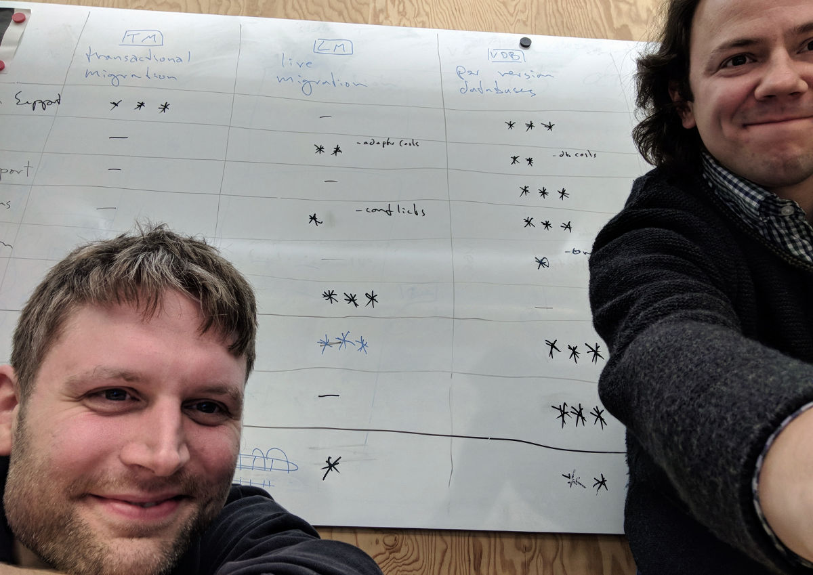

# [Sync Tank](/): Distributed Migration Strategies
## How to handle schema changes in CouchDB
{:.no_toc}

## Table of contents
{:.no_toc}

1. this unordered seed list will be replaced by toc as unordered list
{:toc}

## Introduction

> Software development is change management - Ashley Williams, [A Brief History of Modularity](https://www.youtube.com/watch?v=vypCsVm5z28) at JSConf EU 2017


Imagine you've done everything right: you've built this big, offline-first, decentralized, scalable system that supports all sorts of clients. Your agile teams are working on different parts of the software ecosystem. Of course, your application is live and well, customers are happy - and they demand new features.

So you have to change the data structure.

In a classical monolithic server-side architecture this is more or less a [solved problem -> link missing](), not so for decentralized systems. Here we face two formidable challenges:

1. we cannot rely on transactions to transform data, and
2. there might be clients around that still depend on older versions of the schema.

How can we address the problem that there may be clients running older versions of our application? How can we deal with the fact that an older application might be confronted with newer data because other clients in the system have been updated already and are distributing newer versions of that data? These are among the questions we will have to answer if we want to build larger systems with enough flexibility to respond to change-requests.

At the time of this writing, this is still largely unexplored terrain. You will have a hard time finding articles on this topic, let alone guidelines or collections of best practices. In this article, we will make an effort to start filling this gap. In what follows, you will find a detailed exposition of our thoughts on different strategies for managing distributed data migrations in Apache CouchDB. We will start with simple solutions for simple scenarios and work our way up to the complex offline-first, decentralized, multi-client, scalable systems that we are challenged to build.

TBD
- mention that we have a narrower focus: offline capabiliy and CouchDB

<figure>
  
  <figcaption>The authors: Matthias and Johannes</figcaption>
</figure>

Before you follow us deeper into this discussion and open your minds and hearts to what we have to say, you might want to know who we are and what we do and why you would listen to us in the first place. We are: Johannes J. Schmidt and Matthias Dumke, data architects at a company called [immmr](https://www.immmr.com/), a subsidiary of Deutsche Telekom. The company's main product, [Orbit](https://www.orbit-app.com), is an offline capable app that brings communication to the next level as they say in the product department. It's designed to operate at a large scale in a variety of network conditions (no data available, only GSM, etc.). Our agile teams work on Android, iOS, desktop and web clients as well as on server-side services. Our role is to ensure a seamless integration of data synchronisation between all parts of the system, which is why we are facing on a daily basis all the above mentioned challenges of changing data structures in an offline capable multi client environment.

Moreover Johannes has a decade's worth of experience with distributed databases. He has authored and worked on several widely used tools in the Apache CouchDB ecosystem. He is the main author of the [CouchDB Best Practices](http://ehealthafrica.github.io/couchdb-best-practices/) guidelines he compiled during his work at [eHealth Africa](https://www.ehealthafrica.org/).


## Preliminaries: CouchDB, schemas, and migrations

Going through a detailed technical discussion will be more fruitful if everybody is on the same page from the beginning. This is why in this part we would like to address a handful of general topics including a refresher on CouchDB, our understanding of schemas, migrations, and distributed systems, as well as best practices for working with data schemas in the wild. If you are already familiar with these topics, feel free to skim or skip this section. In the next part we will begin to take a close look at different migration strategies and illustrate them with an example application.

### Who is CouchDB?

As the title of this article suggests we will narrow down the focus of our discussion to software systems backed by CouchDB. In case you didn't know,

> "Apache CouchDB™ lets you access your data where you need it by defining the Couch Replication Protocol that is implemented by a variety of projects and products that span every imaginable computing environment from globally distributed server-clusters, over mobile phones to web browsers."
>
> From the official [Apache CouchDB Documentation](https://couchdb.apache.org/)

We chose to focus on CouchDB because first of all, there is basically no production-ready alternative for a cross-platform data storage that provides synchronization capabilities and is also open source. Check out this [comparison chart](http://offlinefirst.org/sync/) to get an overview of offline capable storage options. And secondly, and pragmatically, we already know a lot about working with CouchDB, so this seems like a sensible place to begin the discussion.

CouchDB is a scalable document oriented store that allows efficient MapReduce data queries via indexing. It is a mature open source project under the Apache foundation that supports clients on all major platforms including web browsers, Android and iOS devices. One of its main features is reliable synchronization of data between different installations via multi master replication (as opposed to master slave replications). We assume some basic familiarity with CouchDB so in the following we will only quickly go over the most important concepts that are relevant in the context of schema migrations. If you need a more in depth introduction to the system, [CouchDB. The definitive Guide](http://guide.couchdb.org/) is a good place to start.

To begin with, let's get some technicalities out of the way: CouchDB provides an HTTP API for all database interactions like storing or retrieving information and managing databases. A single database within the system is just a document that can be created via a simple HTTP request like so: `PUT $COUCH-URL/db-name`. This means that databases are very lightweight and can be created and deleted with ease. As a consequence, and as we shall see below, it is a common practice to create a new database for every user in a system (that's called 'couch-per-user').

Data is transmitted and stored in the form of JSON-documents that can have any valid format you want them to have, plus some attributes such as `_id` and others starting with an underscore that have special meaning. Here's an example document to make this more concrete:

```json
{
  "_id": "todo-item:02cda16f19ed5fe4364f4e6ac400059b",
  "title": "Moonwalk the dog"
}
```

This is a JSON-document storing information about a todo item. We will see more of these documents when we start developing the example application in the next part. But for now we want to focus just on the `_id` attribute, the document id.

CouchDB uses `_id` to uniquely identify documents. If there is any information you need to be unique throughout the database, put it into the `_id`. If you don't set one yourself, CouchDB will create a UUID for you and set it for you, but we recommend to take the opportunity and store more meaningful information here, in other words: make the `_id` semantic! In the example we store the document type along with a UUID. This allows us to quickly identitfy the kind of document we are dealing with if this id is returned e.g. from a query. It also allows us to extract documents by type via the handy [`_all_docs`](http://docs.couchdb.org/en/2.1.1/api/database/bulk-api.html#db-all-docs) query. What's more, it is possible to establish relations between documents through the `_id`. For instance, imagine we also want to store the status of a todo item in it's own document. If we set its `_id` to `todo-item:02cda16f19ed5fe4364f4e6ac400059b:status` we will be able to see at a glance that this is a document of type `todo-item-status` and know which todo item it is associated with. Finding a good strategy for creating `_id`s is one of the challenges when it comes to data design. If you want to learn more about this, please refer to the section [embrace the document id](http://ehealthafrica.github.io/couchdb-best-practices/#embrace-the-document-id) of the CouchDB best practices guide.

As was briefly mentioned above, CouchDB allows to retrieve documents by implementing the powerful [MapReduce](https://static.googleusercontent.com/media/research.google.com/en//archive/mapreduce-osdi04.pdf) pattern. In particular, it allows you to create so-called 'views' that define which data should be returned when they are queried. CouchDB will then build indices to find the requested data quickly and efficiently. As of version 2.0.0 CouchDB also allows queries via [Mango selectors](http://docs.couchdb.org/en/2.1.1/api/database/find.html) that are based on MapRecude and are very performant yet flexible. The ability to query efficiently is of central importance when it comes to data design but there is no need to go into further depth at this point as the discussion of migrations will not require that.

There is one last topic we have to address here if we are going to talk about migrations further down the road, and that is *conflicts*. Conflicts (as opposed to *document update conflicts*) can arise when data is being replicated between multiple instances of CouchDB. To get a feeling for when this may happen, imagine the following 'split brain' scenario: Our friend Andi has CouchDB running on two devices. On both of them he connects to the same database which is currently in the exact same state, meaning all the documents are the same on both devices. This is also true for a document which stores the name of his favorite programming language, Elixir. If there was a network connection between both devices, any data changes on one could be replicated to the other so both would be synchronized. Currently however, there is no network connection. Now Andi goes and changes his favorite language on both devices to something different (in order to break the system, of course, not because his preferences change so rapidly). On the first device, he updates the document to store Lisp, on the other device he updates the same document to store Lua as his favorite Language. Now if both devices reconnect CouchDB will try and bring all data to the same state, but it is inherently unclear which one of the changes should determine the final version of the language document. At this point, CouchDB will keep both versions of the document and leave it to the user to resolve the conflict.

For the time being, these notes will suffice as a review of central CouchDB concepts. We will touch upon many of the points throughout the rest of this article. Next up is an explanation of what we have in mind when we talk about schemas, migrations, and distributed systems.


### Basic concepts: schemas, migrations, and distributed systems

If you want to store and retrieve data in an automated and efficient way, it is important to have some knowledge about the format or structure of this data. This is meta-information specifying things like data attributes and the data types to be used to store them. We would like to think of the **data schema** as all relevant structure-information about the different pieces of data to be stored by an application.

On this general account, a schema formalizes the structure of your data. Many database systems actually require in advance an explicit account of what the data to be stored is going to look like. PostgreSQL for example allows to store relational data where entries have to adhere to one of the [available data formats](https://www.postgresql.org/docs/8.4/static/datatype.html). These formats will even be validated on store-time.

Document databases like CouchDB are sometimes referred to as *schemaless*. This only means that the database will not force you to make your schema explicit before storing data, it does not mean that your data will not have a schema. In the end, a schema is not defined by the database anyways, but by an *application* expecting data to have a certain format. If you don't make your schema explicit, it will simply be *implicit*.

> "Usually when you're talking to a database you want to get some specific pieces of data out of it: I'd like the price, I'd like the quantity, I'd like the customer. As soon as you are doing that what you are doing is setting up an implicit schema."
>
> Martin Fowler, [Introduction to NoSQL](https://www.youtube.com/watch?v=qI_g07C_Q5I)

Thinking in terms of implicit schemas as defined by the application's expectations may require a change of perspective, but it will benefit us in the long run. Moreover, in an upcoming section we will recommend that schemas be made explicit regardless as this will allow us to be more precise about what some piece of data looks like and to keep track of how it changes over time.

Once the application evolves and starts to make new assumptions about the data, flexibility of the (implicit) schema becomes an issue. With a rather lenient document database like CouchDB it may be possible to simply store some additional information in documents at first, but after a while some documents will become outdated and unable to support the functionality new app versions require. At this point we will be forced to transform existing documents into a new form. Changing existing data to adhere to new requirements is called a **data migration**.

The last concept to address are **distributed systems**. According to the Wikipedia,

> "A distributed system is a model in which components located on networked computers communicate and coordinate their actions by passing messages."
>
> Wikipedia, [Distributed computing](https://en.wikipedia.org/wiki/Distributed_computing)

To apply this broad definition to the CouchDB environment, we can interpret database documents as messages, data transfer via replication as message passing, and the various apps on phones and in browers and the backend services as the components located on networked computers. This can mean that data will have to be stored not only on a server but also on user-devices, which in turn must be enabled to synchronize data updates with the rest of the system so all parts can be up to date.

In this distributed scenario, different applications can make very different use of the same data. For instance, an Android app may use data to display a list of todos to the user while a backend service may be interested in the metadata to build usage profiles. We therefore have software that accesses, processes, and stores data in very different locations and according to their very different requirements. For the whole system to be intact it is mandatory that the structure of the data not be changed in any unforseeable way. The different parts of the system, and consequently the different teams working on the different parts of the system, are bound by an (implicit) contract, by the (implicit) data schema they all have to respect. We may even go one step further and say that *the data schema is the effective database API* of the distributed system because it ultimately defines the way in which data can be accessed. From this perspective, a schema-change implies an API change for any part of the system that is dependent on the data. This is why it is of such importance to have a strategy for dealing with schema-changes.

When migrations become necessary in distributed systems, we run into the complex issues this article is about.


### Make your schema explicit!

We have already mentioned that even if people may call your database *schemaless* this does not mean you can actually work without a data schema. Granted, you may be able to change your mind at any time and store differently structured information and the database will be fine with that. This is why schemaless databases have a reputation for facilitating flexible development. But at the very least the data schema will be *implicit* as your applications have certain expectations about what kind information there is in the database. We have found that it is very helpful to be more explicit about the schema. Allow us to argue for that:

1. A data schema that is made explicit makes **communication** about data a lot easier. This is true across time (when you come back to your project three months later) and across teams (when the web team is supposed to add the same functionality to their apps as the Android team).
2. An explicit schema also allows for format checking and **schema validation**, which can expose bugs in applications earlier, and in general lead to more reliable and consistent data. More reliable and consistent data makes application development not only easier, but practically feasible in the first place.
3. Finally, an explicit schema can be **versioned** which makes it possible to track how the format changes over time and even to revert to earlier states.

If this has been convincing to you a plausible follow-up question is how to actually make a data schema explicit. There are a number of tools around to help with that. As this article focuses on CouchDB let us first mention that in the near future the CouchDB team will introduce server-side validations via a *Mango*-like syntax query language. This can be used to enforce requirements on the structure of the data before storing it. You may also know of [JSON schema](http://json-schema.org/), a very flexible schema specification vocabulary. In case you are not familiar with this, here's a simplified example of how we could make the schema of a hypothetical todo item document explicit using JSON schema:

```json
{
  "id": "todo-item-1",

  "properties": {
    "_id": {
      "pattern": "^todo-item:[a-f0-9]{32}$",
      "type": "string"
    },

    "schema": {
      "enum": ["todo-item-1"],
      "type": "string"
    },

    "title": {
      "maxLength": 64,
      "type": "string"
    }

    "isDone": {
      "type": "boolean"
    }
  },

  "required": [
    "_id",
    "schema",
    "title"
  ]
}
```

This specification formulates some expectations and requirements any valid todo item document would have to fulfill. For instance, it requires each such document to set a `title` attribute which must be a string of some maximum length. It is also possible to specify more complex formatting rules the pattern of the `_id` property exemplifies. CouchDB integrates nicely with JSON schema: the above specification could be used to validate documents via the `validate_doc_update` function. To round things off, here is what a corresponding valid document might look like:

```json
{
  "_id": "todo-item:02cda16f19ed5fe4364f4e6ac400059b",
  "schema": "todo-item-1",
  "title": "Clean both swimming pools",
  "isDone": false
}
```

The example features a `schema` attribute on the document with a value of `todo-item-1`. This stores not only the document type but also the schema version of the document, most valuable information once we have to implement schema migrations. We recommend to make the version number a part of the schema id. This way the version is tightly coupled with the data format, while leaving enough room to change document versions independently of each other. For instance, we could upgrade `address-1` documents to `address-2` documents  while the related user data could still be stored in `user-1` documents.

Being explicit about schemas is also the first step to *versioning* them. As a final practical recommendation we suggest to use [semantic versioning](http://semver.org/), properly interpreted to work well with data schemas, in order to keep track of how the schema evolves. We use semantic versioning to determine the version of the *database schema*, which is the collection of all *individual document schemas*. This way it is easy to understand the type and severity of schema changes:

* **Breaking changes** happen every time old documents do not validate against a new schema anymore.
* **Features** are all additions and enhancements that do not affect the validity of existing documents.
* **Fixes** are small improvements like correcting typos in schema descriptions.

To sum up this discussion, introducing format-requirements on schemaless databases opens up a space between purely implicit schemas and rigidly explicit ones, providing greater flexibility when it comes to specifying and changing schema definitions. This way, we can better find the sweet spot between data consistency and flexibility that we see fit for our projects. Storing the schema version of each document in the document paves the way for implementing schema migrations, which we will now turn our attention to.


## Fail fast, fail often

Failure will often lead to success. When you fail with one approach, you can quickly develop new insights into a problem, and you can free your mind and pivot and try out alternatives. This process will often lead to better results than sticking with one initial strategy could ever achieve. So let's fail in this part. In fact, let's fail a couple of times.

So far we have talked about our understanding of schemas and migrations, we have introduced CouchDB and have made some suggestions for how to work with data schemas in practice. Let's now switch gears and start to look at schema migrations proper. We will illustrate different migrations strategies by looking at an example application that will start out simple and get more complex as we go along. In the spirit of this section, all of the strategies discussed here will have serious drawbacks that should nevertheless prepare us well for the upcoming section where we will discuss a select few migration strategies in greater detail and with more success.


### Setting the stage: A toy problem

While this article is not supposed to be a tutorial, it will be instructive to have a working example at hands to illustrate some points. Our example of choice is the 'Hello World' of software applications, the todo-app. A simple todo-app does not look like the most daunting challenge to face from a data architecture perspective: todos can have titles and texts, maybe a creation date and a done-flag. None of this would make you sit down and write an article about different strategies for how to accommodate this information. But things get a lot more interesting once we agree to meet a few additional requirements:

1. Users should be able to edit their todos even when their internet connection is unstable or down and the application should synchronize all changes once it reconnects. In other words: the app must be **offline-capable** (what exactly this means will become clearer as we go along).
2. The application development should be **agile**, meaning that we want to support frequent changes to all aspects of the system, including the data schema.

These two requirements lead us to think about distributed migrations. This may start in the product department, where product managers [obviously](https://medium.com/swlh/designers-will-design-developers-will-develop-and-why-you-must-stop-them-399255275593) want to evolve the app into a full-fledged project management suite. Product decides that a todo should no longer just be open or done but should hold a number of different progress states like 'started', 'blocked', 'rejected', 'completed', etc. No problem, right? We just tweak the schema a bit, the todo state is no longer a Boolean but some form of String or Enum that can hold multiple values and we are done. - But wait, what about the todos that are already in the system? - Maybe we can update them? Or maybe the apps should be able to deal with both kinds of todos? - So we should support two schema versions now and old documents are still valid? And what if someone is using the old version of the app on their phone? The old version doesn't know anything about the new progress states. How could it possibly deal with documents of the new format? - We could force people to upgrade their apps so everybody at least agrees on the new schema. - So you want to make the entire application unusable unless someone goes to the appstore and updates to the latest version? This is not very appealing. - Do you have a better idea?

In fact, we do. Stay tuned.

At this point we have gotten a bit ahead of ourselves and are already discussing migration strategies, albeit in a somewhat hasty and unstructured manner. So let's roll up our sleeves and start building out this app, step by step.


### A Server-side Todo-web-app

In the simplest of todo-app scenarios, we want to enable a number of users to manage a few, or maybe a few thousand todo items from the comfort of their web browser. The basic building blocks to set up such a service are: a client-side application to provide a nice interface, a server to deliver that application, a central database that stores all those todos, and bit of infrastructure to glue the pieces together. We have decided to use CouchDB as our database and as we mentioned above we chose to set up the system such that every user gets their very own database. This is a common practice in the CouchDB world. It entails that there is no way for one user to get direct access to anybody else's data because they are stored in different databases.Everybody manages their own todos in their own database. And yes: once our product goes viral and there are two million users there will be two million databases. Well, Ops problem. In fact, Ops will be happy to find out that CouchDB comes with clustering abilities so scaling up is not a terrifying prospect (unlike when you run out of space with your relational database).

For now, this piecemeal approach of worrying about one user and one database at a time simplifies our problem. To complete the first step and bring version one of our todo-app to the market, all there is to do as far as the schema is concerned is to decide how a single todo item is supposed to look. And since we wanted to start simple, and since the *sine qua non* of a todo item is basically just a title and a flag, here's an example of the first, launch-ready version of a valid todo item document to be stored in a user's CouchDB that also adheres to the schema we specified in the last part:

```json
{
  "_id": "todo-item:cde95c3861f9f585d5608fcd35000a7a",
  "schema": "todo-item-1",
  "title": "reimplement my pet project in Rust",
  "isDone": true
}
```

### The world is changing: new requirements

The first weeks have passed, marketing has done a great job and our app is quite popular, especially with young professional single parents in urban areas. Feature requests are coming in and a decision is made to enhance the product. So we face a new requirement:

```cucumber
As a web app user
I want to mark a todo as important
so that I can find it easier.
```

Obviously the data schema will need some enhancements in order to store that new information. In particular, we will want to add an `isImportant` flag to each todo-item. This change is rather unobtrusive because it leaves already existing todo items intact: since existing documents will not have the `isImportant` attribute, we can simply treat them as not important by default. All we have to do is make sure the app will be able to handle missing `isImportant` flags.

This change was not too hard to implement. A second request that many users have made is the ability to change the color theme of their app:

```cucumber
As a web app user
I want to choose between different color themes
so that I can express myself by personalizing my tools.
```

Obviously, this feature has no implications for the todo items. We decide to introduce a new document type, a `settings`-document, that will store the color information and perhaps other general requirements that will come up in the future. Since we only need one global settings document, we can set the `_id` to something simple.

```json
{
  "_id": "settings",
  "schema": "settings-1",
  "color": "#e20074"
}
```

As with the introduction of an `isImportant` property, the new settings document will not cause existing apps to break. Instead, we can use this document to enhance the experience for users of the new app version. If there is no settings document, the application can simply use the default color that already exists. And if an older app does not know how to deal with settings-documents, it may safely ignore it.

So far we have amended the todo item schema and introduced a new document type. Both operations are non-breaking feature changes to our data schema according to semantic versioning. But now let's look at yet another feature request that will have a deeper impact on our data format:

```cucumber
As a web app user
I want to assign one of many states (`active`, `blocked`, `done`, ...) to a todo item
so that I can have fine-grained control over its progress.
```

We already have the `isDone` property in place that keeps track of an item's progress. This progress information will have to be stored in a different property now, call it `status`. You might be tempted to simply replace one field with another, which would lead to documents like the following:

```json
{
  "_id": "todo-item:ce2f71ee7db9d6decfe459ca9d000df5",
  "schema": "todo-item-2",
  "title": "change the world",
  "isImportant": true,
  "status": "active"
}
```

This is a valid strategy, but let's go the extra mile and think about an even better solution. Up to this point, a todo item has been a rather coherent set of attributes. Yes, a title might have changed, people were able to mark todos as important and at some point in time many of the items would have been marked as done. In all those cases the document would have had to be updated. However, these changes can be expected to be relatively infrequent. In contrast, we're now introducing the concept of a multi-valued status that may change many times across the lifetime of a todo item. It would be great if we didn't have to update the whole document every time someone changes the status. This is why we propose to split the document in two, have a todo item document and save the status separately in a new document type. With these changes, the remaining core todo item might look like this:

```json
{
  "_id": "todo-item:ce2f71ee7db9d6decfe459ca9d000df5",
  "schema": "todo-item-2",
  "title": "change the world",
  "isImportant": true
}
```

And this might be the corresponding status document:

```json
  "_id": "todo-item:ce2f71ee7db9d6decfe459ca9d000df5:status",
  "schema": "todo-item-status-1",
  "status": "active"
}
```

Note how the association of status and todo item is established via the `_id` attribute that is not just used to determine the document type. Splitting the document now enables us to group attributes that commonly change together. Here is not the place to get into a detailed discussion of data design, but feel free to take a look at the [couchdb-best-practices](http://ehealthafrica.github.io/couchdb-best-practices/) guidelines if this discussion got you interested.

At this point, we have reacted to the latest incoming feature request. We can release a new version of the web app that allows users to set different progress states for their items. But wait! What about the items that have been created in the past? The previous approach does not seem to work anymore: we cannot simply choose some sensible defaults and assume that old documents are still valid. Instead we have to find an explicit way to map the old `isDone` values to the new `status`, in other words: we need a data migration!


### Server-side transactional migrations

We are now at a point where a new version of an application may be confronted with older documents in the system that it does not know how to handle. One way of approaching this issue would be to make the app more complex to enable it to deal with older schemas. We will discuss this approach in more detail in the section on live migrations, but for the time being there is a much more common practice that is used in this scenario, one which changes not the app but the data. We will call this approach a 'transactional migration'.

<figure class="diagram" id="figure-1">
  
  <figcaption>
    <b>Figure 1: Transactional Migration.</b>
    <span>
      Introducing a new version of an application may require us to update existing documents (white) to a new version (green). This switch happens at a single point in time. Some documents (two-colored example) can be handled by both app versions and do not need to be transformed at all.
    </span>
  </figcaption>
</figure>

Since we have stored all our data in one central database, it will be easy enough for us to access all existing todo items and update them to adhere to the new schema. Ruby on Rails's way of handling migrations provides a very straight forward example of this approach. In Rails we would define a migration that formalizes the schema change (prepare the database to store the new `status`, move existing `isDone` information over into the `status`, remove the `isDone` field from the todo item table). We would then take the system down, run the migration (the famous `rails db:migrate`, formerly `rake db:migrate`) and hand out the updated application once the database is back up. If anything goes wrong during this process, there will be a rollback because the migration is wrapped into a transaction. During the process we will of course incur some downtime, but on the plus side we always have consistent and up to date documents and everyone will get the latest version of our application.

This same strategy works with CouchDB as well. Let us roughly sketch out the main steps to go through when performing a **transactional migration on CouchDB**. Here's our recipe: First you need to setup a cluster in case you want to revert or abort the migration at some point. Then switch to maintenance mode. Perform a replication of all data from the old to the new cluster. Now run a migration script to update data on the new cluster. If a check verifies that migration was successful, switch to the new cluster and switch off maintenance mode. Done.

[Figure 1](#figure-1) illustrates the transactional migration strategy. It shows how both the application and the documents are updated together in a single step. White documents can be handled by the white version of the app while the green app needs green documents. A special case is the two-colored document. There might be documents that do not need to change during a migration and that can be handled by multiple versions of the client. Think of the settings document we have added previously. Even if we have to change the structure of todo items this does not mean we have to change how the settings document looks.

This transactional migration procedure is very common for the type of monolithic centralized setup we have described so far. It does not come without some [problems of it's own](https://about.futurelearn.com/blog/your-database-is-a-distributed-system) but overall it is a well established and reliable practice. Alas, this is not a viable solution anymore once we ask that our application continue to work without a connection to the internet.


### Going offline is harder than it looks

Up to this point our todo application will simply stop working when the internet connection is down. Instead of the app, users will get a message that they are offline. Or - even worse - if the connection is unstable they will not even get notified about that but they might simply see a white screen while some request is underway and they will wait and hope for a response and wait and hope for a response and wait and eventually get frustrated.

To fix this, we would like users to be able to access the app and perform all the relevant CRUD operations on todo items even if the internet connection is not reliable. Let's make this a feature request:

```cucumber
As an application user
I want to edit todo items even when my internet connection is unreliable
so that I can plan my life without worrying about network quality.
```

This could be done by building full-fledged desktop or native apps or, to start simple, by transforming the already existing web application into a *Progressive Web App* that can be persisted by the browser. In any case, all the relevant application data has to be stored on the client.

Now that a user can create or edit todo items even when the client is offline we need to provide a way to synchronize any changes once it comes back online. Luckily we have CouchDB on our team! There are a number of client-side adaptations like [PouchDB](https://pouchdb.com/) for browsers or [Cloudant sync](https://www.ibm.com/analytics/us/en/technology/offline-first/) for phones that provide CouchDB-like storing capabilities for clients and implement the Couch replication protocol so synchronizing data between different parts of the system becomes simple and fun.

We're not done, though. We do have an application that does not break when the client is offline and that synchronizes changes. But how can we stay agile with this kind of setup? Let's put it this way:

> "Document databases are really cool… until you have to make a breaking change to the schema. Then it feels like “good luck with all that!” :D"
>
> Ben Nadel [on Twitter](https://twitter.com/BenNadel/status/918604059304779776)

To illustrate the problem, let's get back to our previous example and assume we have a working todo app where we have to upgrade todos from a simple `isDone` to a more detailed `status`. Remember, the app has been live for a while, people are using it in version one and they are working with documents that are stored according to schema version one. If we now want to release version two of the app, we might not reach all users at once because some of them are currently offline thanks to our latest enhancements. So we have to deal with the fact that there are old versions of the app around. And they are working with old versions of the documents. Call this the *parallel versions problem.* How can we perform a proper data migration in this scenario? Let's look at some options.

#### Transactional server-side migration

Why can't we just reuse the strategy that has worked well before and update all existing documents on the server?

This would mean that we picked a single point in time where we updated all documents on the server to be compatible with the new application. To see why this fails, consider the following chain of events: Haneen is using the app, version one, in her browser right now. Now you migrate the documents on the server-side database and prepare to hand out the new version of the app. Meanwhile, Haneen has just updated her todo item. The change takes a moment to synchronize to the server, it may also take several hours if she is currently offline. The updated todo item arrives at the server, but because Haneen is using version one of the app, the document that arrives will be outdated. We have inconsistent data in our database.

#### Continuous server-side migration

What if we still use a transactional migration but amend it in the following way: after migrating all the documents we look at each incoming new document on the server and if there is an old document we simply update this one to the new format. This approach would in fact solve the previous problem. If an older app inserted an older document into the system no other part would have to worry about that because the documents would be updated before reaching anyone else.

How can one implement **continuous server-side migrations on CouchDB** you ask? Here's a sketch: First there must be a way to look at incoming documents so they can be updated. CouchDB provides such an option through the `changes` endpoint that allows us to keep track of every event that happens in the database. It is not a bad idea to bundle the different `changes`-endpoints of all user databases together into a **global changes feed**. A backend service could then watch this to see if any outdated document comes in and perform transformations as needed. After the updated document has been saved, there is no need for the old version to be around, so it can safely be deleted.

This strategy solves one important aspect of the *parallel versions problem*. In particular, it deals with the situation where an old app writes old documents into the system. But what if new documents get synced to an older application? What if someone has not yet updated their iPhone app? There is a good chance that an the old app will break when being confronted with newer documents.

#### Server-side adapters

Can we update outdated documents when they arrive at the server? We could provide a versioned API, the old app sends old documents to the previous API version, and a service updates the document to the latest version before it gets persisted.

As a general migration strategy, this looks very promising indeed. It would allow us to write adapters for each API version that could migrate documents on the fly, up and down. However, we cannot pursue this path further here because CouchDB does not provide any hooks that we could use to insert our adapters into the dataflow. This would have serious consequences for many aspects of the system including the replication mechanism. Since this is not an option, let's not have this discussion right now and focus on what is feasible.

#### Client-side transactional migrations

How about performing a transactional migration on the clients? Offline clients could use the old schema as long as they are offline, but once the client is updated to a new version, the first thing it does is migrate all existing data in the client-database which then later syncs the updated data to the server.

TBD: outlook to future deterministic ids

This approach will work, but only in a restricted environment. In particular, it will only work if we have a single client. If your business case allows you to restrict users to only have one single device to use with your application, you might be fine, but once any additional clients enter the stage we are in trouble. Here's why: If you have multiple clients, *each one* will have to perform the transactional migration (otherwise we would be back to the problems we encountered with the first attempt). But if each client updates documents in parallel and syncs them accross the system, this will lead to a large number of conflicts. In principal, CouchDB allows you to handle conflicts and even ignore them so they will be solved automatically, but in this scenario, the large number of conflicts can have an impact on the performance of our system.


## Ohne Worte

TBD

### Client-side live migration

We will use the term 'live migration' to describe on-the-fly transformations of documents to adhere to a different data schema. We have encountered this idea briefly in the previous section when we talked about server-side adapters. Unfortunately, this approach was not feasible. Let's now talk about equipping clients with the necessary capabilities to deal with different schema versions.

The basic idea is to enable an application to read documents with older versions through adapters. [Figure 2](#figure-2) illustrates the strategy in broad strokes: an adapter is provided to update the old (white) document type to a newer version which the new app knows how to handle.

<figure class="diagram" id="figure-2">
  
  <figcaption>
    <b>Figure 2: Live Migration.</b>
    <span>
      An adapter enables the application to read documents of older formats. When it comes to persisting them the app will store the documents in their updated version.
    </span>
  </figcaption>
</figure>

To make this point more concrete, let's take another look at our current problem with the todo app. We already have todo items in the system and we want to release a new version of the app that works with new document versions. The application can read and write these new documents, but what if it encounters an older document? In this case, we could provide it with an adapter that takes in old documents and returns new ones. Here's the case in point:

_An adapter takes in a todo item with an old schema:_

```json
{
  "_id": "todo-item:8f5e6edb6f5208abc14d9f49f4003818",
  "schema": "todo-item-1",
  "title": "Calculate the carbon footprint of a bitcoin transaction",
  "isDone": true
}
```

_And it returns the updated documents, a todo item and a status-document with a plausible mapping from `isDone` to `status`:_

```json
{
  "_id": "todo-item:8f5e6edb6f5208abc14d9f49f4003818",
  "schema": "todo-item-2",
  "title": "Calculate the carbon footprint of a bitcoin transaction"
}
```

```json
{
  "_id": "todo-item:8f5e6edb6f5208abc14d9f49f4003818:status",
  "schema": "todo-item-status-1",
  "status": "done"
}
```

From this point on the app knows how to proceed. Using the adapter, it can treat older documents just as if they were new ones. This looks like a promising strategy, and it is also very efficient because first there is no need to keep multiple versions of documents around, and second transformations will only happen when they are actually needed. This strategy also addresses the problem that an app that is currently offline may continue to create old documents because it hasn't been updated yet. These documents will be synchronized across the system but they will not cause trouble because newer apps have adapters to deal with them.

While this approach seems quite elegant in the scenario we're facing here, i.e. a small application with a very simple change, it may not be the best solution for more complex situations. Plus it has a major drawback that we'll have to address as well. So let's start talking about the downside of client-side live migrations.

#### Functionality duplication leads to unnecessary code

The first problem to address is one of complexity and maintainability. A bit of accounting can help us get the discussion started. Say we start off with a single document type that is in version `v1`. We now update the schema to `v2`, so the app will need an adapter to deal with the older `v1` documents. After the next update to `v3` the new app will now need two adapters: one to deal with `v2` documents and one to deal with `v1` documents that may also still be around. In general, every app that has ever existed in the system may have left documents in the corresponding old versions around. Since we can never be sure that there are no ancient schema versions around we will have to provide `n - 1` adapters for an app that uses data schema version `n`.
But there's more. Since clients can be offline or not get updated, older versions of clients need additional adapters to migrate documents up to their specific version and those add up to what we have to maintain. To round off this part of the analysis, let's just say that all app versions that have ever existed may still be used somewhere, and accordingly all document schema versions that have ever existed will need to be supported. If the current schema version number is `n` we would need to provide

<math xmlns="http://www.w3.org/1998/Math/MathML">
  <mo stretchy="false">(</mo>
  <mi>n</mi>
  <mo>&#x2212;<!-- − --></mo>
  <mn>1</mn>
  <mo stretchy="false">)</mo>
  <mo>+</mo>
  <mo stretchy="false">(</mo>
  <mi>n</mi>
  <mo>&#x2212;<!-- − --></mo>
  <mn>2</mn>
  <mo stretchy="false">)</mo>
  <mo>+</mo>
  <mo>.</mo>
  <mo>.</mo>
  <mo>.</mo>
  <mo>+</mo>
  <mn>2</mn>
  <mo>+</mo>
  <mn>1</mn>
  <mo>=</mo>
  <munderover>
    <mo>&#x2211;<!-- ∑ --></mo>
    <mrow class="MJX-TeXAtom-ORD">
      <mi>i</mi>
      <mo>=</mo>
      <mn>1</mn>
    </mrow>
    <mrow class="MJX-TeXAtom-ORD">
      <mi>n</mi>
      <mo>&#x2212;<!-- − --></mo>
      <mn>1</mn>
    </mrow>
  </munderover>
  <mi>i</mi>
  <mo>=</mo>
  <mfrac>
    <mrow>
      <mi>n</mi>
      <mo stretchy="false">(</mo>
      <mi>n</mi>
      <mo>&#x2212;<!-- − --></mo>
      <mn>1</mn>
      <mo stretchy="false">)</mo>
    </mrow>
    <mn>2</mn>
  </mfrac>
</math>

adapters.

We're not done yet. So far, we have just looked at a single document type, but our schema can accommodate dozens of them. In our example we just had three types (`todo-item`, `status`, `settings`) but to be more general let's say we have `t` different document types. If we introduce a new version for every type with every update we need \(\frac{t n (n - 1)}{2}\) adapters in total or, amongst friends, $ \mathcal{O}(t n^2) $ adapters. This can quickly get out of hand and we have to look at optimizations and compromises.

TBD

- multiple clients: duplication (adapters in Swift, Java, JavaScript, ...)
- hard to fix bugs when things happen on the client
- number of migrators
- code complexity / adapter abundance vs expensive reads - O(t * v^2)?
- views have to be adapted as well


#### No legacy-app dropping and no purging of old documents

TBD

#### Old apps have to force users to do updates

This is probably the biggest concern with live migrations but also the hardest to work through so we will discuss this last. It means that an old app has to be shut down until it is updated. For a simple webapp this may be as easy as requiring a page reload, for a desktop app it may require a restart, but for iOS or Android apps it may require users to visit some appstore and go through a whole procedure for upgrading an application. And what if product decides that updates should be paid for by device? Do we shut down all older apps once someone upgrades a single device?

These are serious concerns that arise because we are unable to meet two requirements at the same time:

1. Make sure newer documents do not end up in older applications' databases. If this is violated, the old app will not know how to handle the new documents and may crash.
2. Make sure documents are synchronized with all relevant associated documents. If this is violated, there may be inconsistent data. Imagine if we had just a status, but the associated todo item was missing, or if we had an address without a user, or a text message without a contact.

It would be possible to enforce the first point on its own. CouchDB provides a mechanism to synchronize only a filtered set of all data (that's called a [filtered replication](...)), and we could use this to exclude data that is too recent to get to clients that are too old. But this would conflict with the second point. If we update only the todo items but not the status then a filtered replication would sync the status documents but filter out the corresponding todo items. This way, a database could end up with status documents without a todo item. The only way to work around this problem is to increase the schema version of *every* document once a single document changes. In a larger setting with dozens or hundreds of document types in the database this would lead to a lot of duplication.

In this section we have introduced client-side live migrations as a viable migration strategy that nonetheless has some serious drawbacks. In the following sections we will direct our attention back to the server as the diver of migrations.

TBD: we could enhance this strategy with per version documents to support old versions.

### Per-version-database
<figure class="diagram" id="figure-3">
  
  <figcaption>Figure 3: Per Version Databases</figcaption>
</figure>

TBD

- New requirement: Legacy support
- scenario: apps for Android and iOS with update-hurdles
- strategy: create a database per version with bi-directional server-side migrations
- benefits: single responsibility (easier to maintain and test)
- caveat: duplicates build up on the server + lot of data-movement on client
- caveat: manage many dbs on the server
- caveat: not seamless because upgrade takes time

### Per-version-documents
<figure class="diagram" id="figure-4">
  
  <figcaption>Figure 4: Per Version Documents</figcaption>
</figure>

TBD

- more elegant strategy: keep multiple document-versions in the same database
- review and repeat context
- description

- Background of this article: eHealth, immmr, offline-camp
  - Johannes worked on eHA together with Jan Lenard on a first migration concept
  - when he joined immmr he faced fear of changing data schema
  - sat together with Ben Kampmann and invented the Per version database migration concept
  - discussed this concept on the [offline camp berlin 2017](http://offlinefirst.org/camp/berlin/) with Gregor Martinus, Bradley Holt, Martin Stadler and others

<figure>
  
  <figcaption>Foto by Gregor Martinus: Migration session at Offline Camp 2017 Berlin</figcaption>
</figure>

## Summary and Evaluation

- The internet is broken

TBD

- discuss matrix and why we favor last solution
- outlook

|                      | Trans&shy;actional Migra&shy;tion | Live Migra&shy;tion | Per Ver&shy;sion Data&shy;bases | Per Ver&shy;sion Docu&shy;ments |
| -------------------- | :-------------------------------: | :-----------------: | :-----------------------------: | :-----------------------------: |
| Drop Version Support | ***                               | -                   | ***                             | **                              |
| Multiple Versions    | -                                 | **                  | **                              | ***                             |
| Legacy App Support   | -                                 | -                   | ***                             | ***                             |
| Distributed Systems  | -                                 | *                   | ***                             | ***                             |
| Seamless Migration   | -                                 | -                   | *                               | ***                             |
| Deduplication        | ***                               | ***                 | -                               | **                              |
| Conflict Safety      | ***                               | ***                 | ***                             | ***                             |
| Purge Version Data   | ***                               | -                   | ***                             | *                               |
| Simplicity           | ***                               | *                   | **                              | ***                             |


- Thanks to all the people who helped here
- Follow us on Github, Twitter
- Link to repo
- Ask for feedback, open PR/issue


